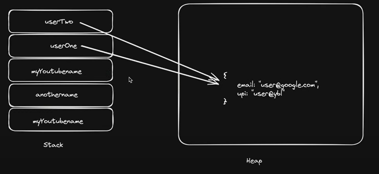
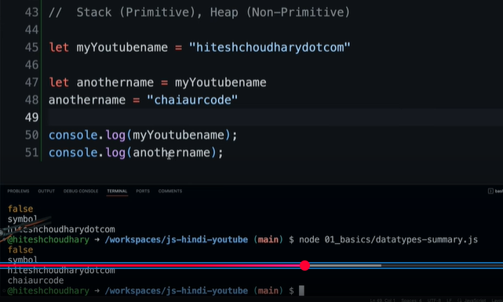
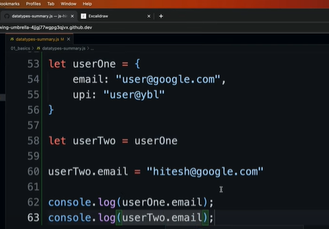
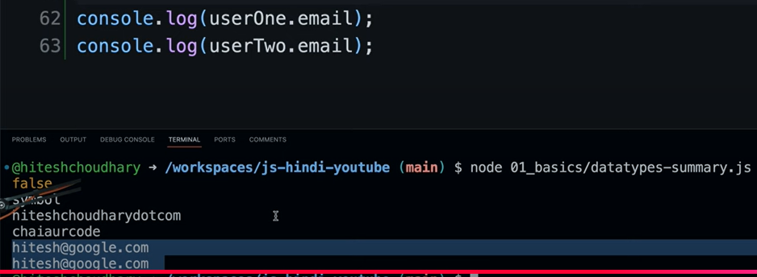

# Stack vs Heap

## Primitive vs Reference





### Note OG value changes upon assignment to copies as well (for reference data types)





In JavaScript, strings—whether you create them as _primitives_ (`"hello"`) or via the `String` constructor (`new String("hello")`)—are **immutable**. That immutability is the reason no method ever “changes” the original string.

---

## 1. Strings are immutable

- **Primitive strings** (e.g. `let s = "foo";`) cannot be altered. Any method like `s.toUpperCase()` returns a brand-new string, leaving `s` untouched.
- **String objects** (e.g. `let sObj = new String("foo");`) wrap a primitive string value internally, but they still expose only **immutable** behavior. All the string methods operate on that internal primitive and return new values; they don’t modify the wrapper’s internal value.

```js
let sObj = new String("foo");
let upper = sObj.toUpperCase();

console.log(sObj.valueOf()); // "foo"
console.log(upper);          // "FOO"
```

Here, `sObj.valueOf()` remains `"foo"` because `toUpperCase()` returned a _new_ string (primitive), it did **not** mutate the `String` object.

---

## 2. Objects vs. mutability

- **Objects** in JS are reference types, but **not all reference types are mutable**.  
  - Plain objects (`{}`), arrays, maps, etc., generally have mutable properties.
  - String wrapper objects have **no mutating methods**; they behave like immutable primitives under the hood.

---

## 3. Call-by-value of references

Even for objects, JavaScript uses **call-by-value** for function arguments. What that means:

1. When you pass an object (or String object) into a function, you pass _a copy of the reference_, not the original variable binding.
2. Unless the object has methods that mutate its internal state, calling a method will never “reach back” and overwrite the original.

```js
function up(s) {
  // s is a copy of the reference. s.toUpperCase() returns a new string.
  return s.toUpperCase();
}

let sObj = new String("bar");
let result = up(sObj);

console.log(sObj.valueOf()); // "bar"  ← unchanged
console.log(result);          // "BAR"
```

---

### Where the confusion comes from

1. **“Objects are always mutated by methods”** is **not** true—objects need to provide mutating methods (e.g. `arr.push()`, `obj.prop = x`). The String prototype has no mutator methods.
2. **Strings as primitives vs. wrappers**: even though `new String(...)` gives you an object living on the heap, it still wraps an immutable value.

---

#### TL;DR

- **Strings are immutable**, whether primitive or via `new String()`.
- All string methods **return new strings**; none mutate the original.
- JavaScript passes _references by value_, so you never get in-place mutation of string content.

Feel free to ask if you’d like to see any more examples or dive deeper into JS’s pass-by-value semantics!
