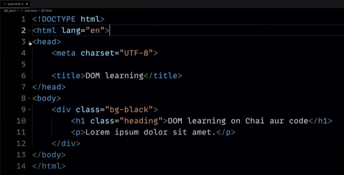
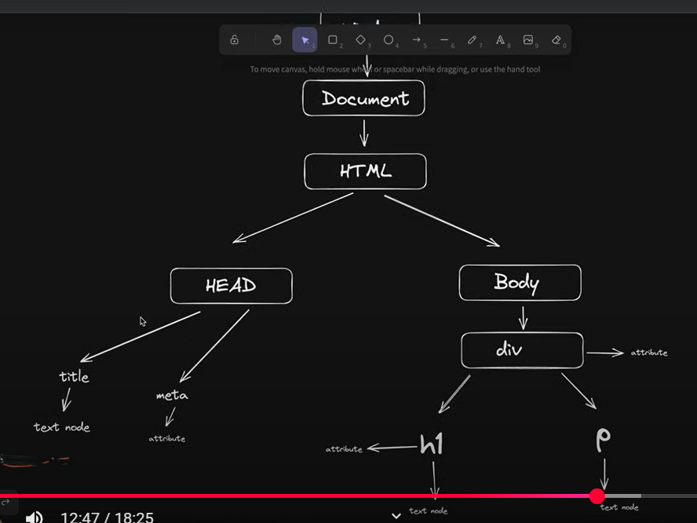
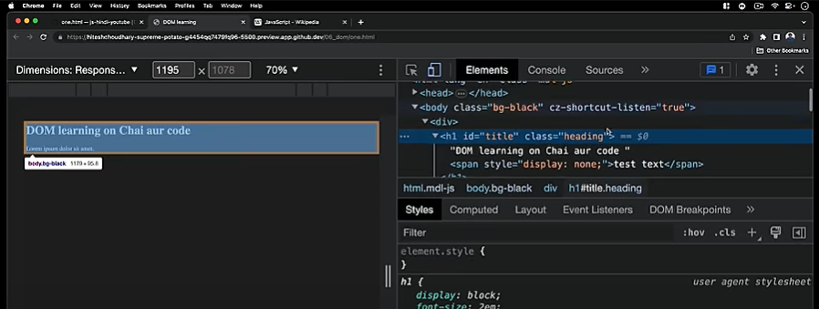
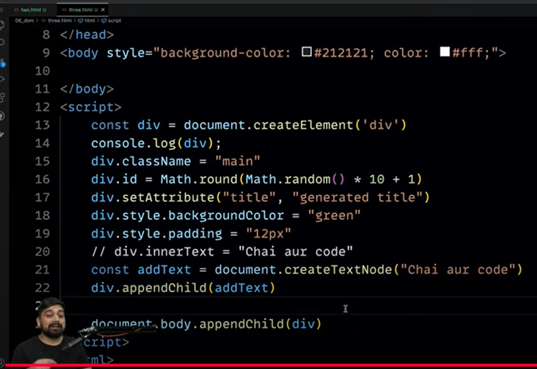
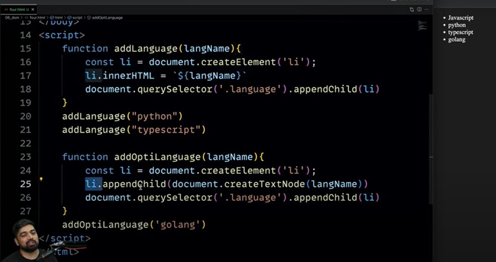

# [vid 31] Introduction to DOM Manipulation

- **DOM and events** are the two key areas to focus on learning well.

## What is DOM?

- DOM stands for **Document Object Model**.
- It represents how your document is structured and how the page looks.

## Exploring the Window and Document Objects

- Typing `console.log()` and inspecting the output reveals a complex **window object**.
- The window object contains many things, including location, Wikipedia tracking information, and the **document object**.
- The **document object** is a key part of the window that we need to study more.
- You can access the document using `window.document`, but since it's so common, you can directly access it by typing `document` in the console.
- `console.log(document)` shows details like `DOCTYPE html`, `head`, and `body`.
- The `window` object itself contains many properties beyond the basic document, but `console.log(document)` typically shows the most relevant parts.
- To see more information about an object in the console, you can use `console.dir()` instead of `console.log()`.
- The document object is based on the DOM model.

## Visualizing the DOM Structure





- The `title` element contains a **text node**.
- A **node** is the term used in the Document Object Model for every part of the document (head, body, title, text, etc.).
- Elements like `meta` might have **attributes** but no text nodes.
- Attributes are properties associated with an element.
- These elements can have **attributes** (like `class` or `title`) and **child elements** or **text nodes**.
- Understanding this diagram is important, including concepts of **children**, **siblings**, and how to **reach** specific elements.

## Accessing Document Information

- The `document` object has many properties and methods.
- You can access properties like `document.baseURI` to get the base URL of the page.

```javascript
document.baseURI;
```

- You can get a collection of all links on the page using `document.links`.
- `document.links` returns an **HTML Collection**, which is **not an array**.
- This is a common mistake; HTML Collections and Node Collections are different from Arrays.
- They can be converted to arrays, but by default, they don't have array methods like `map` or `forEach`.
- However, some properties similar to arrays are available, like accessing elements by index (e.g., `document.links[1]` for the second link).

## Selecting Elements

- One method is `document.getElementById()`.

## Manipulating Elements (Basic Example)

- For example, to change the content of the selected `h1` element:

```javascript
const heading = document.getElementById('firstHeading');
heading.innerHTML = '<h1>Chai aur Code</h1>';
```

Here are detailed markdown notes from the entire video transcript:

## [vid 32] Introduction

- Welcome to the video on DOM selectors, NodeList, and HTMLCollection.

## Setting up the HTML

.className(not .class)

.png>)

.getAttribute('class'), setAttribute('key','value')
> .setAttribute() overwrites so be careful to include all values

.png>)

.png>)

store element in variable

.png>)

use element's variable names to access properties like style & it's key-value pairs

.png>)

```html
<!DOCTYPE html>
<html lang="en">
<head>
    <meta charset="UTF-8">
    <meta name="viewport" content="width=device-width, initial-scale=1.0">
    <title>DOM Learning</title>
    <style>
        .bg-black{
            background-color: #212121;
            color: #fff;
        }
    </style>
</head>
<body>
    <div class="bg-black">
        <h1 id="title" class="heading" title="Learning DOM">DOM Learning on Chai aur Code</h1>
        <p>lorem ipsum dolor sit amet</p>
        <h2>h2 text 1</h2>
        <h2>h2 text 2</h2>
        <h2>h2 text 3</h2>
        <input type="password">
        <ul>
            <li class="list-item">one</li>
            <li class="list-item">two</li>
            <li class="list-item">three</li>
            <li class="list-item">four</li>
        </ul>
    </div>
</body>
```

## Accessing and Modifying Content

- There are multiple ways to access the content inside an element.
- `textContent`: Returns all text content inside the element, including text from hidden elements (like those with `display: none`) and script/style tags, but ignores HTML tags.



```javascript
title.textContent; // Returns "DOM Learning on Chai aur Code test text" (even if part is hidden)
```

- `innerText`: Returns only the text content that is **visible** on the page, respecting CSS styling (like `display: none`). It ignores HTML tags.

```javascript
title.innerText; // Returns "DOM Learning on Chai aur Code" (only if visible)
```

- `innerHTML`: Returns all content inside the element, including **HTML tags**.

```javascript
title.innerHTML; // Returns "DOM Learning on Chai aur Code<span>test text</span>" if a span was added inside
```

- **Difference:** `innerText` cares about visibility, `textContent` does not, and `innerHTML` includes HTML structure.
- You can also **set** the content using these properties.

```javascript
// 
title.innerHTML = '<h1>Chai aur Code</h1>'; // Replaces with new HTML
title.textContent = 'New Text Content'; // Replaces with plain text
title.innerText = 'Visible Text'; // Replaces with plain text
```

- Setting `innerHTML` allows you to inject HTML structure.

## More Selection Methods

- Besides `getElementById`, other selection methods exist:
  - `getElementsByClassName()`: Selects elements by class name.
  - `getElementsByTagName()`: Selects elements by tag name (e.g., 'p', 'div').
  - `getElementsByName()`: Selects elements by the `name` attribute (common for form elements).
- These "Elements" methods (plural) **do not return a single element**; they return a collection of elements.

## Advanced Selection: `querySelector` and `querySelectorAll`

- These methods allow using standard **CSS selectors** to select elements.
- This is often preferred as it aligns with existing CSS knowledge.
- `document.querySelector()`: Returns the **first element** in the document that matches the specified CSS selector.

```javascript
document.querySelector('h1'); // Selects the first h1 element
document.querySelector('#title'); // Selects the element with id 'title'
document.querySelector('.heading'); // Selects the first element with class 'heading'
document.querySelector('input[type="password"]'); // Selects the input with type="password"
document.querySelector('ul li'); // Selects the first li inside a ul
document.querySelector('ul li:first-child'); // Selects the first li inside a ul
```

- `document.querySelectorAll()`: Returns a **NodeList** containing all elements in the document that match the specified CSS selector.

```javascript
document.querySelectorAll('h2'); // Selects all h2 elements
document.querySelectorAll('li'); // Selects all li elements
document.querySelectorAll('.list-item'); // Selects all elements with class 'list-item'
document.querySelectorAll('.mw-headline'); // Selects elements on Wikipedia with class 'mw-headline'
```

- You can also use `querySelector` or `querySelectorAll` on an existing element to search within its descendants.

```javascript
const ul = document.querySelector('ul'); // Select the ul first
const firstLi = ul.querySelector('li'); // Select the first li within that specific ul
```

## Understanding Collections: NodeList vs. HTMLCollection

- **Important Concept:** The return types of selection methods are not always standard Arrays.
- **`HTMLCollection`**: Returned by methods like `getElementsByClassName()` and `document.links`.
  - It is **not an Array**.
  - It is a **live collection**, meaning it updates automatically when the underlying document changes [source does not explicitly state 'live', but this is a key difference, adding outside info for clarity].
  - It does **not** have standard Array methods like `forEach`, `map`, `filter`, etc..
  - You can access elements by index (`collection`) or `item()` method.
  - You can get its length (`collection.length`).
- **`NodeList`**: Returned by methods like `querySelectorAll()`.
  - It is **not an Array**.
  - It is typically a **static collection** (does not update automatically, adding outside info for clarity), except for `childNodes` which is live [source does not explicitly state 'static', adding outside info for clarity].
  - It **does have** the `forEach` method available.
  - It does **not** have other standard Array methods like `map`, `filter`, `reduce` by default.
  - You can access elements by index (`nodeList`) or `item()` method.
  - You can get its length (`nodeList.length`) [source implies this but doesn't explicitly state it].

## Iterating and Manipulating Collections

- You **cannot** directly apply methods like `.style` to an entire `HTMLCollection` or `NodeList` as if it were a single element.

```javascript
// This will NOT work as expected on the collection/NodeList itself
const allH2 = document.querySelectorAll('h2'); // Returns NodeList
allH2.style.color = 'green'; // Error or no effect
```

- You must **iterate** through the collection to apply changes to individual elements.
- For `NodeList`, you can use the `forEach` method.

```javascript
const allH2 = document.querySelectorAll('h2');
allH2.forEach(function(h) { // Or use arrow function: (h) => { ... }
    h.style.color = 'green'; // Apply style to each individual h2 element
    h.style.backgroundColor = 'orange'; // Apply background color to each individual h2
    h.innerText = 'Updated H2'; // Change text content of each h2
});
```

- For `HTMLCollection`, since `forEach` is not available, you typically use a standard `for` loop [source implies this by showing the lack of `forEach` and then conversion, adding outside info for clarity].

```javascript
const listItemsHTML = document.getElementsByClassName('list-item'); // Returns HTMLCollection

// Using a standard for loop (example - not explicitly shown looping this way in source)
// for (let i = 0; i < listItemsHTML.length; i++) {
//     listItemsHTML[i].style.color = 'blue';
// }
```

- **Converting to Array:** If you need full Array functionality (like `map`, `filter`), you can convert an `HTMLCollection` or `NodeList` to a standard Array using `Array.from()`.

```javascript
const listItemsHTML = document.getElementsByClassName('list-item');
const listItemsArray = Array.from(listItemsHTML); // Converts HTMLCollection to Array

listItemsArray.forEach(function(li) { // Now forEach is available
    li.style.color = 'orange';
});

// You can also use other Array methods now
// listItemsArray.map(...)
// listItemsArray.filter(...)
```

- While `forEach` is available on NodeList, converting to an Array using `Array.from()` is still an option if you need other Array methods like `map`.

## [vid 33] Setting up the HTML and Initial DOM Selection

- The video uses a basic HTML file with a parent `div` containing four child `div` elements representing days of the week (Monday, Tuesday, Wednesday, Thursday).
- Basic styling (background color, text color) is added to improve readability.
- The browser's inspector tool is used to view elements and the console to see output.
- Initial script is added directly within `<script>` tags in the HTML body.

### Selecting the Parent Element

- The first target is to select the parent element.
- This is done using `document.querySelector`.

- ```javascript
  const parent = document.querySelector('.parent');
  console.log(parent);
  ```

- Logging the `parent` variable shows the parent `div` element, containing its child day elements.

### Accessing Children using `.children`

- An interesting property, `.children`, is introduced to access the child elements of a parent.

- ```javascript
  console.log(parent.children);
  ```

- This logs an **HTMLCollection** containing all the child elements.
- The HTMLCollection shows the four day `div` elements with a length of 4.
- HTMLCollection is described as an "almost array-like" property.

### Accessing Individual Child Elements

- Individual children can be accessed using array-like indexing on the HTMLCollection.

- ```javascript
  console.log(parent.children); // Accessing the second child (index 1)
  ```

- This selects and logs the `div` element representing Tuesday. (Note: Index 0 is Monday, so index 1 is Tuesday).

### Accessing Inner HTML of a Child

- Once an element is selected, its inner HTML can be accessed using `.innerHTML`.

- ```javascript
  console.log(parent.children.innerHTML);
  ```

- This logs the text content "Tuesday".

### Looping Through Children

- Although HTMLCollection is not a true array, the classic `for` loop can be used to iterate through its elements.

- ```javascript
  for (let i = 0; i < parent.children.length; i++) {
      console.log(parent.children[i].innerHTML);
  }
  ```

- This loop iterates through all children and prints their `innerHTML`, showing "Monday", "Tuesday", "Wednesday", and "Thursday".

### Styling Children Directly

- Styling changes can be applied directly to selected child elements.
- Example: Changing the color of the first child element.

- ```javascript
  parent.children.style.color = "orange";
  ```

- This makes the "Monday" text orange.
- Other styles like padding can also be added.

- ```javascript
  div.style.padding = "12px"; // Example when creating a new element
  ```

### Accessing First/Last Element Child

- Properties like `firstElementChild` and `lastElementChild` are very useful for selecting the first or last child element directly.

- ```javascript
  console.log(parent.firstElementChild);
  console.log(parent.lastElementChild);
  ```

- `firstElementChild` selects the first child element (Monday).
- `lastElementChild` selects the last child element (Thursday).
- These properties are described as interesting and helpful for targeting elements with JavaScript.

## Traversing from Child to Parent and Siblings

- It's also possible to move from a child element back up to its parent.
- Selecting a specific child element using `querySelector`.

- ```javascript
  const dayOne = document.querySelector('.day'); // Selects the first element with class 'day' (Monday)
  console.log(dayOne);
  ```

- Using `querySelector` is described as a slightly expensive operation as it traverses the DOM tree. The DOM is described as a tree structure. Understanding the tree structure helps appreciate why DS (Data Structures) are important in this context.

### Accessing the Parent Element from a Child

- The `parentElement` property can be used to directly access the parent of a selected element without traversing the entire tree again. This is more optimized.

- ```javascript
  console.log(dayOne.parentElement);
  ```

- This logs the parent `div` element.

### Accessing Sibling Elements

- Sibling elements (elements at the same level) can be accessed using `nextElementSibling` and `previousElementSibling`.

- ```javascript
  console.log(dayOne.nextElementSibling);
  ```

- `nextElementSibling` from the first day (`dayOne`) selects the next sibling element (Tuesday).

## Understanding NodeList and Complexities

- A property called `childNodes` provides access to a **NodeList**, which is different from HTMLCollection.

- ```javascript
  console.log("Nodes: ", parent.childNodes);
  ```

- Logging `childNodes` reveals a NodeList which often contains more nodes than just the element nodes.
- In the example, the NodeList has a length of 11(with comment), even though there are only 4 day elements.
- This is because the DOM tree structure includes more than just elements; it also includes **text nodes** and **comment nodes**.
- For example, line breaks (enters) in the HTML code are counted as text elements in the NodeList.
- Adding a comment in the HTML also adds a comment node to the NodeList, increasing its length.
- The NodeList shows the complexity of the tree structure the browser creates behind the scenes.
- Understanding `childNodes` is particularly important for concepts like React's internal workings, which heavily use `childNodes` for manipulation in memory.

## Creating New Elements Programmatically

- A new section focuses on creating DOM elements using JavaScript.
- A new HTML file (`3.html`) is set up with just basic body and styling.
- The goal is to inject content into the empty body using JavaScript.

### Creating an Element Node

- The `document.createElement()` method is used to create any HTML element.

- ```javascript
  const div = document.createElement('div'); // Creates a new div element
  console.log(div);
  ```

- Creating an element makes it available in memory, but it is **not yet displayed** on the web page.
- You can create any element type, like `h1`, by passing the tag name to the method.

### Setting Attributes and Properties



- Once an element is created, properties like `className` and `id` can be set directly.

- ```javascript
  div.className = "main"; // Sets the class name
  div.id = "myId"; // Sets the ID
  ```

- The video demonstrates creating a random ID using `Math.random()`, `Math.floor()`, etc., just for demonstration.

- ```javascript
  div.id = Math.floor(Math.random() * 10 + 1); // Example of setting a random ID
  ```

- For setting other or custom attributes, the `setAttribute()` method is preferred over direct property assignment in many cases.
- `setAttribute()` takes the attribute name and value as arguments.

- ```javascript
  div.setAttribute('title', 'generated title'); // Sets a 'title' attribute
  ```

- The reason `setAttribute` is sometimes preferred is that direct properties like `className` or `innerText` might first fetch the existing value and then overwrite, whereas `setAttribute` directly sets the value, potentially saving a "round trip".

### Adding Content (Text) to the Element

- Content can be added using `innerText` or `innerHTML`.

- ```javascript
  div.innerText = "Chai aur Code"; // Sets the text content
  ```

- However, the video introduces and discusses the alternative approach of creating a **Text Node** and appending it.

- ```javascript
  const addText = document.createTextNode("Chai aur Code"); // Creates a text node
  div.appendChild(addText); // Appends the text node to the div element
  ```

- Creating a text node and appending it is presented as an alternative to using `innerText`/`innerHTML`, preferred by some developers for potential optimization reasons (avoiding the "round trip" discussed earlier), although this is a point of debate.

### Attaching the Element to the Document

- The created element exists in memory but needs to be attached to the document to become visible on the web page.
- The `appendChild()` method is used to add a child element to an existing parent element in the document.
- To add the created `div` to the page, it is appended to the `document.body`.

- ```javascript
  document.body.appendChild(div); // Appends the created div to the body
  ```

- After this step, the newly created `div` element with its content, attributes, and styles becomes visible on the web page.

## Re-using code

- Once an element can be created and added, this logic can be wrapped in a **function**.
- The function can accept arguments for text, styles, etc..
- This function can then be used inside a **loop** to generate multiple elements dynamically.



Okay, here are detailed markdown notes from the provided YouTube transcript, formatted as requested.

## DOM Manipulation: Edit and Remove Elements

This video is the final one covering DOM manipulation. The goal is to feel confident in building projects using DOM manipulation and basic JavaScript. It will cover creating, removing, and editing DOM elements.

### Initial Setup

The video starts by setting up a basic HTML file (`dom-four.html`) with a title "Chai aur Code". Inside the `<body>`, an unordered list (`<ul>`) with the class `language` is created. A list item (`<li>`) is added inside the `<ul>` with the text "JavaScript".

A basic style is added to the `<body>` for visibility, setting the `background-color` to `212127` and `color` to `white`.

### Adding List Items (Basic Approach)

The task is to add another list item. A function named `addLanguage` is designed to take a language name (`langName`) as a parameter.

The steps for this basic approach are:

- Create a list item element. This is done using `document.createElement('li')` and storing it in a variable, e.g., `li`.
- Add a value to the list item. The basic way is to use `li.innerHTML = langName`.
- Select the parent unordered list (`<ul>`) with the class `language`. This is done using `document.querySelector('.language')`.
- **Append** the created list item as a child to the selected parent. This is done using `.appendChild(li)`.

Here's the basic function implementation:

```javascript
function addLanguage(langName) {
    const li = document.createElement('li'); // Create <li> element
    li.innerHTML = langName; // Add content using innerHTML
    document.querySelector('.language').appendChild(li); // Select parent and append child
}
```

To use the function, call it with the desired language name:

```javascript
addLanguage("python"); // Adds "python"
addLanguage("typescript"); // Adds "typescript"
```

A potential issue with using `innerHTML` and appending to the end of a list like this, especially with many elements, is that it may require the entire DOM tree to be traversed repeatedly, potentially causing performance issues. While not a major problem for small projects, it's less **optimized**.

### Adding List Items (Optimized Approach)

An alternative, more **optimized** approach for adding elements is suggested. This approach also uses a function, named `addOptiLanguage`.

The steps for this optimized approach are:

- Create a list item element. Similar to the basic approach, use `document.createElement('li')`.
- Instead of using `innerHTML`, create a **text node** for the content. This is done using `document.createTextNode(langName)`.
- **Append** the created text node directly to the list item element. This is done using `li.appendChild(textNode)`. This approach avoids traversing the entire tree structure required by `innerHTML`.
- Select the parent unordered list (`<ul>`) with the class `language`. This is done using `document.querySelector('.language')`.
- **Append** the list item element (which now contains the text node) to the parent. This is done using `.appendChild(li)`.

Here's the optimized function implementation:

```javascript
function addOptiLanguage(langName) {
    const li = document.createElement('li'); // Create <li> element
    // Create text node and append directly to <li>
    li.appendChild(document.createTextNode(langName));
    document.querySelector('.language').appendChild(li); // Select parent and append child
}
```

To use the function, call it:

```javascript
addOptiLanguage("golang"); // Adds "golang"
```

Both approaches add the element, but the optimized method using `appendChild` with a text node is generally recommended for larger projects as it doesn't require parsing the entire HTML tree like `innerHTML` can.

### Editing List Items

Editing values requires first **selecting** the element to be edited.
`document.querySelector` is used for selection. It supports various CSS selectors.

**Example: Editing the second language (Python)**
To select the second list item, a selector like `li:nth-child(2)` can be used. This selects the second `<li>` element within its parent.

```javascript
const secondLanguage = document.querySelector('li:nth-child(2)'); // Selects the second <li> element
```

**Editing Method 1: Using `innerHTML`**
Once selected, you can change the content using `innerHTML`.

```javascript
secondLanguage.innerHTML = "mojo"; // Replaces the content of the second <li> with "mojo"
```

This method works but, as discussed earlier, using `innerHTML` can be less **optimized**.

**Editing Method 2: Using `replaceWith`**
A more structured approach involves creating a *new* element with the desired content and replacing the existing element with it.

- Create a *new* list item element.
- Add content to the new list item. `textContent` can be used for this (`newLi.textContent = "Mojo"`). While similar to `innerHTML`, `textContent` primarily deals with text content and is often simpler when you don't need to parse HTML within the content.
- Select the existing element you want to replace (e.g., `secondLanguage`).
- Use the `replaceWith()` method on the selected element, passing the new element as the argument.

Here's the implementation:

```javascript
const newLi = document.createElement('li'); // Create a new <li> element
newLi.textContent = "Mojo"; // Add text content to the new element

const secondLanguage = document.querySelector('li:nth-child(2)'); // Select the element to be replaced
secondLanguage.replaceWith(newLi); // Replace the selected element with the new element
```

Using `replaceWith` replaces the entire selected element with the new one.

**Editing Method 3: Using `outerHTML`**
Another method is to change the `outerHTML` property of the selected element. This replaces the selected element *and* its contents with the new HTML string provided.

**Example: Editing the first language (JavaScript)**
To select the first list item, a selector like `li:first-child` can be used.

```javascript
const firstLang = document.querySelector('li:first-child'); // Selects the first <li> element
```

Then, change its `outerHTML`:

```javascript
firstLang.outerHTML = '<li>TypeScript</li>'; // Replaces the entire first <li> element with a new one containing "TypeScript"
```

This requires providing the full HTML tag for the new element.

Several ways to edit elements have been shown:

- Changing `innerHTML`.
- Replacing with a new element using `replaceWith()`.
- Changing `outerHTML`.

### Removing List Items

Removing elements is described as simple.
Again, the element to be removed must first be **selected**.

**Example: Removing the last language (Golang)**
To select the last list item, a selector like `li:last-child` can be used.

```javascript
const lastLang = document.querySelector('li:last-child'); // Selects the last <li> element
```

Once selected, the element can be removed using the `remove()` method.

```javascript
lastLang.remove(); // Removes the selected element from the DOM
```

This is the simplest way to remove an element given its reference.

### Conclusion and Next Steps

The video concludes by summarizing the DOM manipulation topics covered so far:

- How the DOM works and its tree structure.
- Node list and traversing techniques (parents, children, siblings).
- Creating new elements, appending, styling, and margins.
- Using `querySelector` and selectors like `nth-child`.
- Editing elements using various methods (`innerHTML`, `replaceWith`, `outerHTML`).
- Removing elements using the `remove()` method.

The next step is to start building **projects** using these concepts. The focus will be on functionality in JavaScript, not extensive CSS styling, though basic styling resources may be provided separately. The goal is to build confidence in project development.
