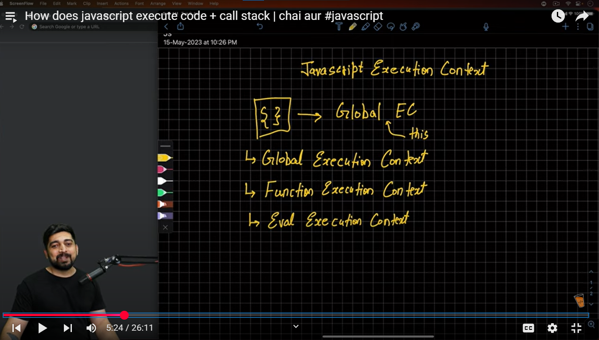
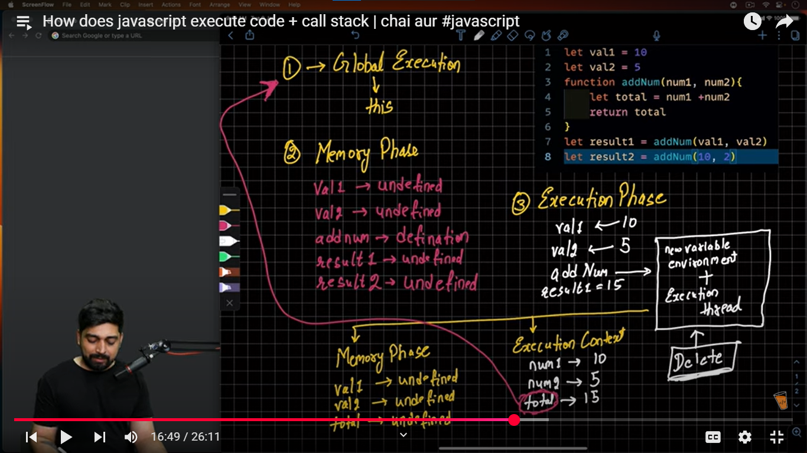
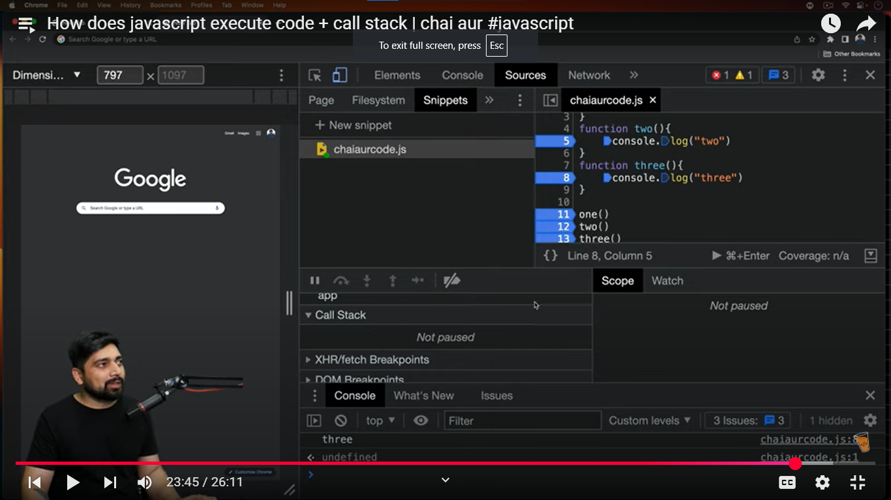
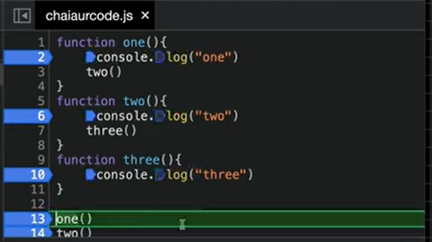

# How does javascript execute code + call stack | chai aur #javascript

## Javascript execution context

Global EC & Function EC are the two main.
Eval is in something called mongoose.

## Call stack

> Note: Save each time before running

### Checking Call Stack when functions execute one-by-one

### Checking Call Stack when functions execute inside each other(callback?)

